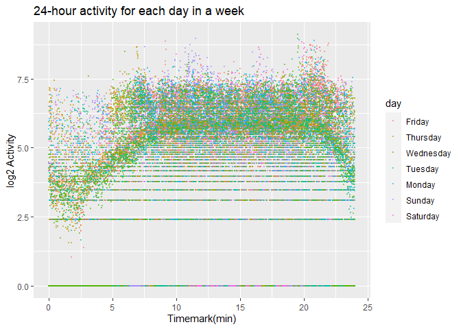
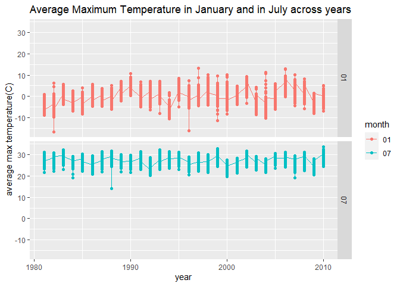
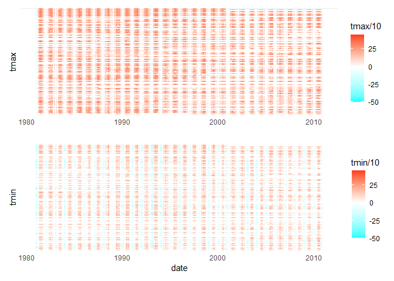
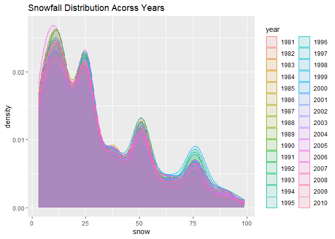

p8105_hw3_zl3263
================
2022-10-12

*import libraries and data*

``` r
library(tidyverse)
```

    ## ── Attaching packages ─────────────────────────────────────── tidyverse 1.3.2 ──
    ## ✔ ggplot2 3.3.6      ✔ purrr   0.3.4 
    ## ✔ tibble  3.1.8      ✔ dplyr   1.0.10
    ## ✔ tidyr   1.2.0      ✔ stringr 1.4.1 
    ## ✔ readr   2.1.2      ✔ forcats 0.5.2 
    ## ── Conflicts ────────────────────────────────────────── tidyverse_conflicts() ──
    ## ✖ dplyr::filter() masks stats::filter()
    ## ✖ dplyr::lag()    masks stats::lag()

``` r
library(p8105.datasets)
library(rnoaa)
```

    ## Registered S3 method overwritten by 'hoardr':
    ##   method           from
    ##   print.cache_info httr

``` r
library(patchwork)
data("instacart")
data("ny_noaa")
```

### Problem 1

``` r
head(instacart)
```

    ## # A tibble: 6 × 15
    ##   order_id product_id add_to_c…¹ reord…² user_id eval_…³ order…⁴ order…⁵ order…⁶
    ##      <int>      <int>      <int>   <int>   <int> <chr>     <int>   <int>   <int>
    ## 1        1      49302          1       1  112108 train         4       4      10
    ## 2        1      11109          2       1  112108 train         4       4      10
    ## 3        1      10246          3       0  112108 train         4       4      10
    ## 4        1      49683          4       0  112108 train         4       4      10
    ## 5        1      43633          5       1  112108 train         4       4      10
    ## 6        1      13176          6       0  112108 train         4       4      10
    ## # … with 6 more variables: days_since_prior_order <int>, product_name <chr>,
    ## #   aisle_id <int>, department_id <int>, aisle <chr>, department <chr>, and
    ## #   abbreviated variable names ¹​add_to_cart_order, ²​reordered, ³​eval_set,
    ## #   ⁴​order_number, ⁵​order_dow, ⁶​order_hour_of_day

The dataset records the order information of instacart website. It has
1384617 rows and 15columns. It has 15 variables containing information
like the order id , product id, product names etc. Each row records one
product in an order and relevent information both on the order and the
product like the date of the order and the department of the product.

### Problem 2

``` r
# load and tidy the data
accelerometer = read_csv('data/accel_data.csv')%>%
  janitor::clean_names()%>%
  mutate(isweekend = ifelse(day == c("Saturday", "Sunday"), TRUE, FALSE),.before = activity_1)
```

    ## Rows: 35 Columns: 1443
    ## ── Column specification ────────────────────────────────────────────────────────
    ## Delimiter: ","
    ## chr    (1): day
    ## dbl (1442): week, day_id, activity.1, activity.2, activity.3, activity.4, ac...
    ## 
    ## ℹ Use `spec()` to retrieve the full column specification for this data.
    ## ℹ Specify the column types or set `show_col_types = FALSE` to quiet this message.

    ## Warning in day == c("Saturday", "Sunday"): 长的对象长度不是短的对象长度的整倍数

``` r
# what does "encode data with reasonable variable classes" mean?
accelerometer_dailytotal = select(accelerometer,colnames(accelerometer)[1:4])
total_activity = rowSums(select(accelerometer,colnames(accelerometer)[5:1444]))
accelerometer_dailytotal$total_activity = total_activity
remove(total_activity) #not elegant but how to optimize?
head(accelerometer_dailytotal)
```

    ## # A tibble: 6 × 5
    ##    week day_id day      isweekend total_activity
    ##   <dbl>  <dbl> <chr>    <lgl>              <dbl>
    ## 1     1      1 Friday   FALSE            480543.
    ## 2     1      2 Monday   FALSE             78828.
    ## 3     1      3 Saturday TRUE             376254 
    ## 4     1      4 Sunday   TRUE             631105 
    ## 5     1      5 Thursday FALSE            355924.
    ## 6     1      6 Tuesday  FALSE            307094.

``` r
# tibble with sum generated
```

``` r
accelerometer_dailytotal %>%
  group_by(day)%>%
  summarize(mean_activity = mean(total_activity))
```

    ## # A tibble: 7 × 2
    ##   day       mean_activity
    ##   <chr>             <dbl>
    ## 1 Friday          458342.
    ## 2 Monday          371740.
    ## 3 Saturday        273847.
    ## 4 Sunday          383843.
    ## 5 Thursday        418230.
    ## 6 Tuesday         359848.
    ## 7 Wednesday       425954.

The total activity shows a increasing trend in 7 days from Saturday in
previous week to Friday in the next week.

``` r
#prepare accelerometer for plotting.
accelerometer_forplot = 
  pivot_longer(
    accelerometer,
    activity_1:activity_1440,
    names_to = "timemark",
    values_to = "activity"
  )%>%
  mutate(timemark = as.integer(substr(timemark,10,13)))

head(accelerometer_forplot)
```

    ## # A tibble: 6 × 6
    ##    week day_id day    isweekend timemark activity
    ##   <dbl>  <dbl> <chr>  <lgl>        <int>    <dbl>
    ## 1     1      1 Friday FALSE            1     88.4
    ## 2     1      1 Friday FALSE            2     82.2
    ## 3     1      1 Friday FALSE            3     64.4
    ## 4     1      1 Friday FALSE            4     70.0
    ## 5     1      1 Friday FALSE            5     75.0
    ## 6     1      1 Friday FALSE            6     66.3

``` r
accelerometer_forplot$day = factor(accelerometer_forplot$day, 
                                   levels = rev(c('Saturday','Sunday','Monday','Tuesday','Wednesday','Thursday','Friday')))

ggplot(accelerometer_forplot,aes(x = timemark/60, y = log(activity), color = day)) +
  geom_point(alpha = 0.5, size = 0.5) +
  xlab("Timemark(min)") +
  ylab("log2 Activity") +
  ggtitle("24-hour activity for each day in a week")
```

<!-- -->

``` r
# no problem with this pic but why the data looks like that:(
```

According to the fig, the activity is the lowest during the 0 to 5
o’clock and at a higher level during wake time, which is consistent with
the living clock of a person. The activity level does not show
distinction across each day in a week.

### Problem 3

*description*

``` r
head(ny_noaa)
```

    ## # A tibble: 6 × 7
    ##   id          date        prcp  snow  snwd tmax  tmin 
    ##   <chr>       <date>     <int> <int> <int> <chr> <chr>
    ## 1 US1NYAB0001 2007-11-01    NA    NA    NA <NA>  <NA> 
    ## 2 US1NYAB0001 2007-11-02    NA    NA    NA <NA>  <NA> 
    ## 3 US1NYAB0001 2007-11-03    NA    NA    NA <NA>  <NA> 
    ## 4 US1NYAB0001 2007-11-04    NA    NA    NA <NA>  <NA> 
    ## 5 US1NYAB0001 2007-11-05    NA    NA    NA <NA>  <NA> 
    ## 6 US1NYAB0001 2007-11-06    NA    NA    NA <NA>  <NA>

``` r
colSums(is.na(ny_noaa))/nrow(ny_noaa)
```

    ##        id      date      prcp      snow      snwd      tmax      tmin 
    ## 0.0000000 0.0000000 0.0561958 0.1468960 0.2280331 0.4371025 0.4371264

The dataset contains the weather station record from January 1,1981 to
December 31,2021. It has 2595176observations and 7 variables. There are
some key variables such as id denotes the weather station ID, prcp
denotes the precipitation, tmax and tmin denote the maximum and minimum
temperature separately.

There are a lot missing values in this dataset. 14.69% snowfall and
22.80% snow depth data is missing. 43.71% temperature record is missing.

``` r
ny_noaa = separate(ny_noaa,date,c("year","month","day"),remove = FALSE)%>%
  na.omit(ny_noaa)
# I checked the value of precipitation, '22860' is that possible? 2286mm in 24 hours in NY. I prefer to believe that it is an error record.  
# What is the meaning of reasonable units ? 
sort(table(ny_noaa$snow),decreasing = TRUE)[1]
```

    ##       0 
    ## 1112758

According to the dataset information, the variable and corresponding
units are shown as below:

| Variable Name | Unit   |
|:--------------|--------|
| prcp          | 0.1 mm |
| snow          | mm     |
| snwd          | mm     |
| tmax          | 0.1 C  |
| tmin          | 0.1 C  |

The most frequent value for snow fall is 0, it’s probably because in
most of the days in a year New York doesn’t have snow.

*max temperature in Jan and July*

``` r
# stationinfo = select(ghcnd_stations(),c("id","latitude","longitude"))
# suddenly I realized that the requirement is calculate average on stations not on years. 
ny_noaa$tmax = as.integer(ny_noaa$tmax)
ny_noaa$year = as.integer(ny_noaa$year)
ny_noaa %>%
  group_by(year,month) %>%
  summarise(mean_tmax = mean(tmax,na.rm = TRUE)) %>%
  filter(month %in% c("01", "07"))  %>%
  ggplot(aes(x = year , y = mean_tmax/10, color = month))+
  geom_point() +
  geom_line() +
  ylab("average max temperature(C)")+
  ggtitle("Average Maximum Temperature in January and in July across years") +
  facet_grid(month ~.)
```

    ## `summarise()` has grouped output by 'year'. You can override using the
    ## `.groups` argument.

<!-- -->

The temperature in July is much higher than January, which indicates
that New York is in the northern hemisphere. Outliers are not obvious in
averaged data.

*making two-panel plot showing tmax vs tmin*

``` r
ny_noaa$tmax = as.numeric(ny_noaa$tmax)
ny_noaa$tmin = as.numeric(ny_noaa$tmin)
heatTmax = ggplot(ny_noaa,aes(x = date, y = id, fill = tmax/10))+
  geom_tile()+
  theme(axis.ticks = element_blank(), axis.text.y = element_blank())+
  xlab("")+
  ylab("tmax")+
  scale_fill_gradient2(limits = c(-50,45),
                       low = "cyan",high = "red")

heatTmin = ggplot(ny_noaa,aes(x = date, y = id, fill = tmin/10))+
  geom_tile()+
  theme(axis.ticks = element_blank(), axis.text.y = element_blank())+
  ylab("tmin")+
  scale_fill_gradient2(limits = c(-50,45),
                       low = "cyan",high = "red")

heatTmax/heatTmin
```

<!-- -->

*making a plot showing distribution by year*

``` r
ny_noaa$year = as.character(ny_noaa$year)
ny_noaa %>%
  filter(snow > 0 & snow < 100)  %>%
  ggplot(aes(snow,fill= year,color = year))+
  geom_density(alpha = 0.1)
```

<!-- -->
